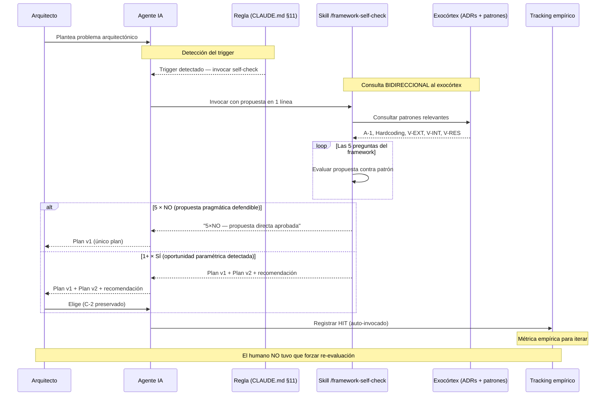

# Patrón C-3 Bidireccional y Meta-Validación del Agente

> *"Un exocórtex que solo registra decisiones es una biblioteca. Un exocórtex que consulta sus propias decisiones antes de actuar es una constitución. La diferencia no es semántica — es operacional."*

---

## La tesis

El patrón C-3 original (Exocórtex de Memoria Activa) resuelve el problema de **dónde guardar** las decisiones arquitectónicas del sistema. Su formulación canónica es unidireccional: el Arquitecto y sus agentes **escriben** decisiones al exocórtex para que los agentes futuros las **lean** como contexto.

Esta formulación tiene un gap operacional silencioso: **los mismos agentes que escriben nuevas decisiones no consultan las decisiones previas como constraint antes de proponer**. El exocórtex se usa como biblioteca de referencia, no como gate ejecutable. El resultado es un anti-patrón sistémico que solo emerge tras uso intensivo real: el agente propone soluciones lineales por default aunque el framework esté documentado, y solo la intervención humana reconduce al camino no-lineal.

El **C-3 Bidireccional** cierra ese loop: el exocórtex se vuelve consultable **por el mismo agente que lo alimenta**, convirtiendo cada propuesta arquitectónica en un proceso de auto-validación contra constraints previamente registrados.

---

## El problema que resuelve

### El anti-patrón observado

Tras uso intensivo del framework en un proyecto real, emergió un patrón sistémico en el comportamiento del agente IA asistente del Arquitecto:

1. El humano plantea un problema
2. El agente propone **Plan v1** — solución pragmática lineal
3. El humano detecta que el plan viola algún patrón del framework (A-1, G-1, etc.)
4. El humano interviene: *"re-evaluá aplicando el framework no-lineal"*
5. El agente propone **Plan v2** — solución paramétrica alineada al framework
6. El Plan v2 se adopta

Ratio observado pre-corrección: **100% de detecciones de anti-patrón dependieron del humano**. El agente tenía la memoria del framework disponible, pero **no la consultaba antes de proponer**. Solo la usaba cuando el humano lo forzaba explícitamente.

Esto es C-3 unidireccional funcionando como biblioteca: los documentos existen, son consultables, pero no son **gate**.

### La raíz estructural

Los modelos de lenguaje carecen de introspección confiable sobre sus propios sesgos. Una instrucción textual *"aplicá el framework antes de proponer"* funciona intermitentemente — igual que un humano que promete contar hasta diez antes de hablar. La disciplina interna falla bajo presión temporal o en contextos donde la solución lineal "suena razonable".

Lo que sí es robusto: **externalizar el gate al flujo observable**. En vez de prometer disciplina, cristalizar el checkpoint como regla persistente + skill ejecutable + métrica empírica.

---

## La solución: C-3 Bidireccional

El exocórtex deja de ser solo destino de escritura y pasa a ser **fuente consultable en tiempo de decisión**. El agente, antes de proponer una decisión arquitectónica al Arquitecto, ejecuta un gate de auto-validación contra las decisiones previas registradas.

### Los tres componentes ejecutables

**Componente 1 — Regla persistente en instrucciones del agente**

La instrucción no vive en memoria efímera de sesión. Se registra en el archivo de instrucciones globales del agente (equivalente a `CLAUDE.md`, `.cursorrules`, `system prompt` del asistente) con triggers explícitos:

```markdown
## Meta-validación antes de propuestas arquitectónicas

ANTES de proponer al Arquitecto cualquiera de:
- Crear o modificar un ADR
- Crear o modificar un skill o protocolo reutilizable
- Agregar función a biblioteca compartida
- Recomendar arquitectura conversacionalmente ("recomiendo X", "propongo Y")
- Fix paramétrico sobre infraestructura

DEBO invocar auto-validación contra el framework ANTES de escribir la respuesta.
```

**Componente 2 — Skill ejecutable de auto-check**

Una meta-skill invocable por el propio agente (no por el Arquitecto) que aplica las preguntas del framework a la propuesta del propio agente. El output obligatorio es:

- Plan v1 (pragmático) — la propuesta inicial
- Plan v2 (no-lineal) — la reformulación aplicando el patrón que correspondía
- Recomendación explícita con justificación desde framework

**Componente 3 — Métrica empírica de adopción**

Registro simple de cada propuesta arquitectónica:
- ¿Invoqué el self-check sin que el humano lo pidiera? (hit)
- ¿El humano tuvo que forzar la re-evaluación? (miss)

Ratio hit/total es la métrica. Objetivo a largo plazo: ≥70%. Umbral de alarma: <50% → el diseño falla y requiere iteración.

### Secuencia temporal del patrón



El elemento clave: **la consulta al exocórtex ocurre ANTES de la respuesta al Arquitecto, no después**. Esa es la diferencia estructural con C-3 unidireccional.

---

## Validación empírica

Aplicado en un proyecto real de dominio regulatorio complejo tras una sesión intensiva de desarrollo.

### Baseline pre-implementación (muestra documentada)

| Caso | Propuesta inicial del agente | Reconducción tras presión humana |
|---|---|---|
| Fix de error HTTP en adaptador externo | `if statusCode === X` IF hardcodeado | Tabla declarativa `HTTP_ERROR_MAP` (Patrón A-1) |
| Actualización de agente auxiliar | "Port selectivo" — duplicar lógica | Biblioteca compartida consumida por N agentes (G-1/A-1/G-2) |

**Ratio baseline:** 0/2 auto-invocación del framework = 100% dependencia de intervención humana.

### Primer día post-implementación (misma sesión)

Tres propuestas arquitectónicas consecutivas del humano al agente, todas con triggers explícitos:

| # | Pregunta del humano | Auto-invocación del self-check |
|---|---|---|
| 1 | "¿Actualizamos el agente auxiliar con los nuevos aprendizajes?" | ✅ SÍ — agente detectó falta de evidencia empírica, recomendó no actuar |
| 2 | "¿Enriquecemos los prompts del agente con framework?" | ✅ SÍ — agente evaluó 5 opciones y recomendó no implementar sin ≥2 casos empíricos |
| 3 | Humano aportó contexto de dominio (scope acotado) | ✅ SÍ — agente reframeó conclusión: "fuera de scope por diseño", no "esperar evidencia" |

**Ratio primer día:** 3/3 = **100%** (muestra pequeña, pero validación direccional positiva).

### Patrón emergente

El self-check no solo previno sobre-ingeniería por falta de evidencia — también actuó como mecanismo de absorción de contexto del Arquitecto. En HIT 3, el Arquitecto aportó información sobre el dominio del agente auxiliar que no estaba en el contexto previo del sub-agente; el self-check forzó reframe en lugar de aferrarse a la conclusión anterior.

**Esto es C-2 CPU/GPU en acción a nivel meta:** el Arquitecto decide scope arquitectónico, el agente re-procesa la pregunta con el nuevo scope — en lugar de defender su posición previa.

---

## Diferencia formal con C-3 unidireccional

| Dimensión | C-3 Unidireccional | C-3 Bidireccional |
|---|---|---|
| **Rol del exocórtex** | Destino de escritura | Destino de escritura **y** fuente consultable pre-decisión |
| **Quién consulta** | Agentes futuros, en lecturas de onboarding | Mismo agente que escribe, en tiempo de decisión |
| **Cuándo se consulta** | Ad-hoc, según criterio del agente | Obligatorio ante triggers explícitos (ADR, skill, lib, propuesta arquitectónica) |
| **Qué produce** | Contexto informativo | Gate bloqueante con output estructurado (Plan v1 + v2 + recomendación) |
| **Métrica de éxito** | Exocórtex poblado | Ratio de auto-invocación ≥70% |
| **Riesgo cubierto** | Re-explicación de contexto en cada sesión | Agente proponiendo soluciones lineales pese a framework documentado |

---

## Relación con otros patrones

### Con C-1 (Pre-Computación del Dominio)

C-1 resuelve *"no codifiques sin comprimir el dominio primero"*. El C-3 Bidireccional resuelve *"no propongas arquitectura sin consultar tu propio framework primero"*. Son el mismo principio — *pre-computación antes de actuar* — aplicado a dos dominios distintos (negocio externo vs. framework interno del propio agente).

### Con C-5 (ReAct Zero-Trust)

C-5 prohíbe al agente emitir conclusiones sin evidencia instrumental. El C-3 Bidireccional extiende esta idea: prohíbe al agente emitir propuestas arquitectónicas sin evidencia **desde el propio framework**. El agente consulta el exocórtex como el C-5 consulta sus tools — ambos son formas de **anclaje a la realidad** antes del output.

### Con G-1 (Debugging de Generadores Sistémicos)

G-1 dice: *"si un error aparece 3+ veces, corrige el generador, no las instancias"*. El C-3 Bidireccional aplica G-1 al propio agente: *"si el agente propone lineal por default, el fix no es corregir cada caso — es corregir el generador, que es la falta de auto-consulta al framework antes de actuar"*.

ADR-006 (el artefacto que implementa este patrón en el proyecto empírico) es G-1 paramétrico aplicado al sesgo sistémico del agente.

### Con el Manifiesto Muerte al Hardcoding

El tipo IV de hardcoding (cognitivo) se resuelve tradicionalmente externalizando el framework a memoria persistente. El C-3 Bidireccional completa esa resolución: no basta con externalizar — el agente debe **consultarla activamente**. Sin consulta, el framework vive en memoria pero no opera.

---

## Cuándo aplicar este patrón

**Aplicar cuando:**

- El proyecto tiene un framework arquitectónico maduro documentado
- El agente IA asistente debe proponer decisiones arquitectónicas regularmente
- Se observa empíricamente que el humano interviene para forzar aplicación del framework
- Hay ratio medible de propuestas que requieren reconducción humana

**No aplicar cuando:**

- El proyecto aún está en C-1 (comprimiendo dominio) — aplicar este patrón sobre framework no estabilizado es overengineering
- El agente opera en dominio táctico acotado (patches de catálogo conocido) donde la creatividad arquitectónica no es el objetivo — aplicar aquí convierte paramédico en cirujano
- No existe al menos un ADR/constitución inicial que sirva como constraint a consultar

---

## Diagnóstico de aplicabilidad (3 preguntas)

Antes de implementar C-3 Bidireccional en un proyecto, responder:

1. **¿Existe un exocórtex mínimo?** (Constitución + al menos 3-5 ADRs). Si no, implementar C-3 Unidireccional primero.
2. **¿Hay evidencia empírica de intervención humana por anti-patrón?** Registrar al menos 2 casos donde el humano forzó reconducción. Sin evidencia, la implementación es especulativa.
3. **¿El agente opera en dominio conversacional-estratégico?** Si opera en dominio puramente táctico (paramédico), el patrón no aplica.

Si las tres respuestas son SÍ, el patrón está validado para implementación.

---

## Anti-patrones a evitar en la implementación

### Anti-patrón 1 — Self-check como formalidad vacía

Si el agente reporta "5 preguntas: NO, NO, NO, NO, NO" mecánicamente sin análisis real, el patrón está muerto. La señal de alarma es **ratio 100% de self-checks con todas las respuestas negativas** — estadísticamente improbable si se aplica honestamente.

### Anti-patrón 2 — Aplicación universal

Si el agente invoca el self-check antes de cada respuesta conversacional (incluso triviales), genera fricción y desprestigia la skill. Los triggers deben ser explícitos y acotados a momentos arquitectónicos reales.

### Anti-patrón 3 — Self-check como post-justificación

El orden es: self-check → formular propuesta. Si el agente primero propone y luego "valida", está usando el patrón como teatro, no como gate.

### Anti-patrón 4 — Métrica ausente

Sin tracking empírico de ratio hit/miss, no hay forma de saber si el patrón funciona. Sesiones sin registro son invisibles para la iteración.

---

## Conclusión

El C-3 Bidireccional completa la ecuación del exocórtex: no solo escribir decisiones, sino consultarlas antes de tomar nuevas decisiones que podrían contradecirlas.

Es un patrón aparentemente menor — agregar un paso de auto-consulta al flujo del agente. Pero captura una verdad operativa central: **un framework que no se aplica a sí mismo es decoración, no infraestructura cognitiva**.

El agente que construyó el framework debe ser el primero en aplicárselo.

---

*Para la implementación ejecutable de referencia del skill de auto-validación, ver [`07-avances/framework-self-check-skill.md`](../07-avances/framework-self-check-skill.md).*
*Para el caso empírico completo con métricas del baseline y la validación post-implementación, ver [`05-evidencia/validacion-meta-framework.md`](../05-evidencia/validacion-meta-framework.md).*
