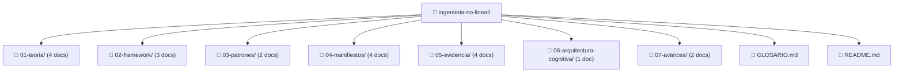
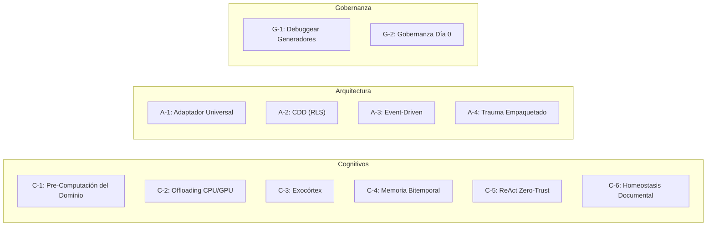

# Análisis Completo: Repositorio de Ingeniería No Lineal V5

## Visión General

Repositorio de conocimiento (knowledge base) que formaliza la **Ingeniería No Lineal (INL)** — una metodología de construcción de software donde un solo Arquitecto, orquestando IA como procesador paralelo, produce resultados **15x–25x** superiores al paradigma lineal tradicional (equipo de 3-5 devs).

> **Tesis central:** `Arquitectura Enterprise × Agilidad de Fundador × Orquestación de IA = Resultados Outlier`

---

## Estructura del Repositorio (20 archivos)

---

## Mapa de Contenidos por Capa

### 🧠 01-teoria/ — El "Por Qué"

| Documento | Contenido clave |
|---|---|
| [paper-ingenieria-no-lineal.md](file:///c:/Proyectos/Claude/Claude%20code/Repositorio%20Ingenieria%20No%20Lineal/01-teoria/paper-ingenieria-no-lineal.md) | Paper fundacional. 3 mecanismos: eliminación de fricción cognitiva, orquestación CPU/GPU, dividendos compuestos |
| [ecuacion-del-outlier.md](file:///c:/Proyectos/Claude/Claude%20code/Repositorio%20Ingenieria%20No%20Lineal/01-teoria/ecuacion-del-outlier.md) | Las 3 variables multiplicativas: Enterprise + Solitario + IA |
| [abandono-preparado.md](file:///c:/Proyectos/Claude/Claude%20code/Repositorio%20Ingenieria%20No%20Lineal/01-teoria/abandono-preparado.md) | Métrica última: el sistema sobrevive sin su creador. 4 escudos: Edge Identity-Lock, DLQ, Grave-Digger Bots, Idempotencia |
| [teoria-cibernetica-v5.md](file:///c:/Proyectos/Claude/Claude%20code/Repositorio%20Ingenieria%20No%20Lineal/01-teoria/teoria-cibernetica-v5.md) | Sistemas homeostáticos, Singularidad V5 (meta-arquitectura autónoma), Anticuerpos del Creador |

---

### ⚙️ 02-framework/ — El "Qué"

| Documento | Contenido clave |
|---|---|
| [framework-vision-general.md](file:///c:/Proyectos/Claude/Claude%20code/Repositorio%20Ingenieria%20No%20Lineal/02-framework/framework-vision-general.md) | **Los 7 pilares**: C-1 (Pre-Computación), C-2 (CPU/GPU), C-3 (Exocórtex), A-1 (Adaptador Universal), A-2 (CDD/RLS), A-3 (Event-Driven), G-1 (Debuggear Generadores), G-2 (Gobernanza Día 0) |
| [protocolo-peap-v5-144h.md](file:///c:/Proyectos/Claude/Claude%20code/Repositorio%20Ingenieria%20No%20Lineal/02-framework/protocolo-peap-v5-144h.md) | **Ciclo de 6 días**: Día -1 (C-1), Día 1 (Constitución/RLS), Día 2 (Silueta/Generación), Día 3 (Perímetro), Día 4 (Poda/Auditoría), Día 5 (Auto-Healing), Día 6 (Institucionalización) |
| [patrones-auto-healing.md](file:///c:/Proyectos/Claude/Claude%20code/Repositorio%20Ingenieria%20No%20Lineal/02-framework/patrones-auto-healing.md) | A-4 (Trauma Empaquetado/DLQ), C-4 (Memoria Bitemporal), C-5 (ReAct Zero-Trust) |

---

### 🔧 03-patrones/ — El "Cómo"

| Documento | Contenido clave |
|---|---|
| [c1-precomputacion-de-dominio.md](file:///c:/Proyectos/Claude/Claude%20code/Repositorio%20Ingenieria%20No%20Lineal/03-patrones/c1-precomputacion-de-dominio.md) | Método de compresión cognitiva: 3 fases (mapeo ecosistemas, puntos hostiles, separación de modos) + test de salida |
| [directivas-xml-agentes.md](file:///c:/Proyectos/Claude/Claude%20code/Repositorio%20Ingenieria%20No%20Lineal/03-patrones/directivas-xml-agentes.md) | System Prompt XML para agentes IA + 5 meta-principios (Persistencia atómica, Shift-Left, Isomorfismo, Intenciones, Markdown Exocórtex) |

---

### 📜 04-manifiestos/ — El "Por Qué Importa"

| Documento | Contenido clave |
|---|---|
| [muerte-al-hardcoding.md](file:///c:/Proyectos/Claude/Claude%20code/Repositorio%20Ingenieria%20No%20Lineal/04-manifiestos/muerte-al-hardcoding.md) | 4 tipos de hardcoding letal: temporal, seguridad, emocional, cognitivo |
| [sistemas-autonomos-v5.md](file:///c:/Proyectos/Claude/Claude%20code/Repositorio%20Ingenieria%20No%20Lineal/04-manifiestos/sistemas-autonomos-v5.md) | Automatizar el caso de fallo, no solo el éxito. DLQ + Autoconservación + Zero-Trust |
| [resistencia-al-legacy-code.md](file:///c:/Proyectos/Claude/Claude%20code/Repositorio%20Ingenieria%20No%20Lineal/04-manifiestos/resistencia-al-legacy-code.md) | Legacy = amnesia cognitiva. Solución: Exocórtex inmortal + Inmunidad insobornable |
| [singularidad-semantica.md](file:///c:/Proyectos/Claude/Claude%20code/Repositorio%20Ingenieria%20No%20Lineal/04-manifiestos/singularidad-semantica.md) | Superar RAG tradicional → Grafo ontológico con categorización, causalidad y Centinela Cognitivo |

---

### 📊 05-evidencia/ — El Caso Real

| Documento | Contenido clave |
|---|---|
| [genesis-y-metricas-sprint.md](file:///c:/Proyectos/Claude/Claude%20code/Repositorio%20Ingenieria%20No%20Lineal/05-evidencia/genesis-y-metricas-sprint.md) | Timeline real: C-1 completado en 34 min. 13+ módulos, 19 tablas RLS, 25 flujos, 215+ parches |
| [tablas-datos-empiricos.md](file:///c:/Proyectos/Claude/Claude%20code/Repositorio%20Ingenieria%20No%20Lineal/05-evidencia/tablas-datos-empiricos.md) | Datos: overhead coordinación ~8-16h/semana, 65% del tiempo es fricción, factor 8x-12x calendario / 20x+ persona-días |
| [antipatrones-y-kpis.md](file:///c:/Proyectos/Claude/Claude%20code/Repositorio%20Ingenieria%20No%20Lineal/05-evidencia/antipatrones-y-kpis.md) | 4 anti-patrones (feature creep, debuggear síntomas, conexión prematura, omitir cierre) + tabla de KPIs |
| [retrospectiva-sprint.md](file:///c:/Proyectos/Claude/Claude%20code/Repositorio%20Ingenieria%20No%20Lineal/05-evidencia/retrospectiva-sprint.md) | Fortalezas (enterprise Día 1, Deep Flow, deuda catalogada) + Desafíos (docs vs ejecución, sostenibilidad, perfeccionismo) |

---

### 🧬 06-arquitectura-cognitiva/ — El Exocórtex

| Documento | Contenido clave |
|---|---|
| [diseno-master-brain.md](file:///c:/Proyectos/Claude/Claude%20code/Repositorio%20Ingenieria%20No%20Lineal/06-arquitectura-cognitiva/diseno-master-brain.md) | **Grafo Maestro**: 3 categorías (LEYES/HISTORIA/ESTADO), Handshake cognitivo, Delta cognitivo, Bootstrap desde Día 1, criterio de filtrado, principio de privacidad. Implementación: Zep Cloud / Graphiti |

---

### 🚀 07-avances/ — Agencialidad de Grado V5

| Documento | Contenido clave |
|---|---|
| [agente-reparador-autonomo-l5.md](file:///c:/Proyectos/Claude/Claude%20code/Repositorio%20Ingenieria%20No%20Lineal/07-avances/agente-reparador-autonomo-l5.md) | L5 Auto-Reparación Cognitiva, Principio Cero-Escritura (HITL), Multi-Grafos |
| [homeostasis-documental-bitemporal.md](file:///c:/Proyectos/Claude/Claude%20code/Repositorio%20Ingenieria%20No%20Lineal/07-avances/homeostasis-documental-bitemporal.md) | Enrutador Bitemporal Zero-Touch (Memoria Evolutiva vs Baseline) y auditoría vía AST |

---

## Taxonomía Completa de Patrones

---

## Conexión con tu Trabajo Real

Basado en las conversaciones previas, este repositorio es el **corpus teórico** que fundamenta tu implementación práctica:

| Concepto INL | Implementación en Sistema de Misión Crítica |
|---|---|
| Grafo Maestro / C-4 Bitemporal | **Zep Cloud** — memoria del agente C-1 Sentinel |
| A-4 Trauma Empaquetado / DLQ | Patrones de auto-healing en los flujos n8n |
| A-2 CDD / RLS | **Supabase** con Row Level Security multi-tenant |
| C-5 ReAct Zero-Trust | Protocolo de diagnóstico del Sentinel con tools |
| G-2 Gobernanza Día 0 | CI/CD en GitHub Actions, branch protection |
| Directivas XML | System prompts del agente Sentinel |
| Hardcoding Cognitivo eliminado | Memoria persistente Zep eliminando re-explicación |

---

## Estado del Repositorio

- ✅ Corpus teórico **completo** (20 documentos, ~100K chars)
- ✅ Cross-references internas coherentes entre documentos
- ✅ Glosario con definiciones y links a fuentes
- 🔲 Pendiente: casos de implementación por dominio
- 🔲 Pendiente: plantillas y scaffolding reutilizable
- 🔲 Pendiente: ejemplos de código con patrones aplicados
- 🔲 Pendiente: guías de integración (Supabase, n8n, Zep, ElevenLabs)
